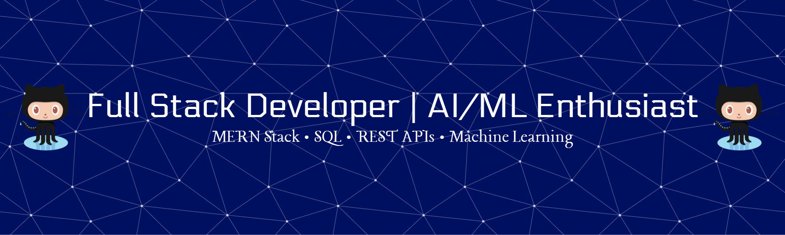

<h1 align="center">Hola 👋, I'm Pousali Chowdhury</h1>

  

<h3 align="center">A Full Stack Developer and AI/ML Enthusiast from India</h3>

  

- 🌱 I’m currently learning **Data Structures & Algorithms, System Design, Advanced SQL, and AI Integration in Web Applications.**

 

- 👯 I’m looking to collaborate on **Full Stack Web Development and AI-powered Applications.**

- 🤝 I’m looking for help with **Advanced AI/ML deployment, cloud technologies, and scalable system design.**

- 👨‍💻 All of my projects are available at [https://pousalichowdhury.github.io/myPortfolio/](https://pousalichowdhury.github.io/myPortfolio/)

- 💬 Ask me about **MERN Stack, SQL, REST APIs, JWT Authentication, MongoDB, Artificial Intelligence, Machine Learning, CNNs, and Genetic Algorithms.**

- 📫 How to reach me **chowdhurypousali12@gmail.com**

- 📄 Know about my experiences [https://shorturl.at/h2GUN](https://shorturl.at/h2GUN)

- ⚡ Fun fact **I enjoy turning real-world problems into software solutions and can spend hours debugging a single issue just to learn something new.**

<h3 align="left">Connect with me:</h3>

<h3 align="left">Languages and Tools:</h3>

                 

&nbsp;

